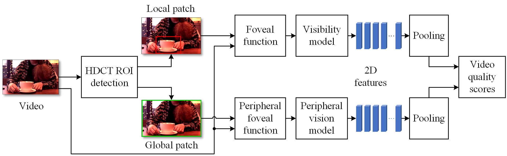
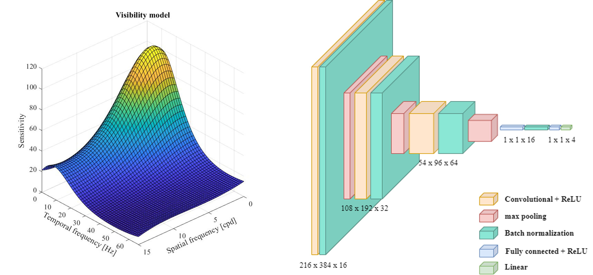
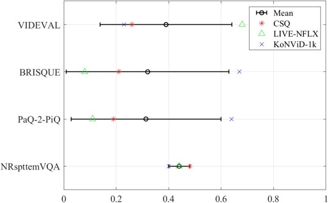
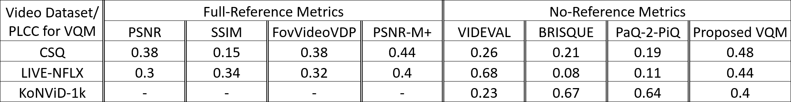

# NRspttemVQA
Non-reference video quality assessment metric.

There is a strong need for non-reference video quality metrics for user-generated video content to prevent loss of video quality caused by distortion during recording, compression, and signal transmission. Here, we contribute to advancing the issue of streaming quality by creating a large-scale dataset with video compression and transmission artefacts. Our final dataset consists of 4.1 million video quality perceptual thresholds by users. We also created a new first nonreference video quality metric that includes the psychophysical features of the user’s video experience, which provides stability in predicting the user’s subjective rating of a video. Our experimental results show that the proposed video quality metric achieves the most stable performance on three independent video datasets. We believe our study will expand further research into deep learning-based video quality metrics modelling.

 We partition video frames into global and local patches. The local patch represents the part of the frame inside the region of interest, while the global patch represents the rest of the frame. Using human visual system models, we extract spatial and temporal characteristics for each frame (2D). After splitting into patches, the global patch passes through the peripheral vision model, which allows considering the change of contrast sensitivity threshold in some regions of the frame depending on the distance of the region of interest from the supposed centre of gaze (in our case, from the centre of the region of interest). The local patch is filtered by a model of contrast sensitivity of the human visual system without considering the peripheral component.

Finally, the merged features (joining channels) from the videos are processed by a time series network that efficiently captures perceptual quality changes over time and predicts one quality score for each video.

 Proposed video quality metric NRspttemVQA has a comparable correlation interval, with stably working full reference metrics.

# Contact information

If you would like more information, feel free to email your request to vladimir.a.mazin@gmail.com.
